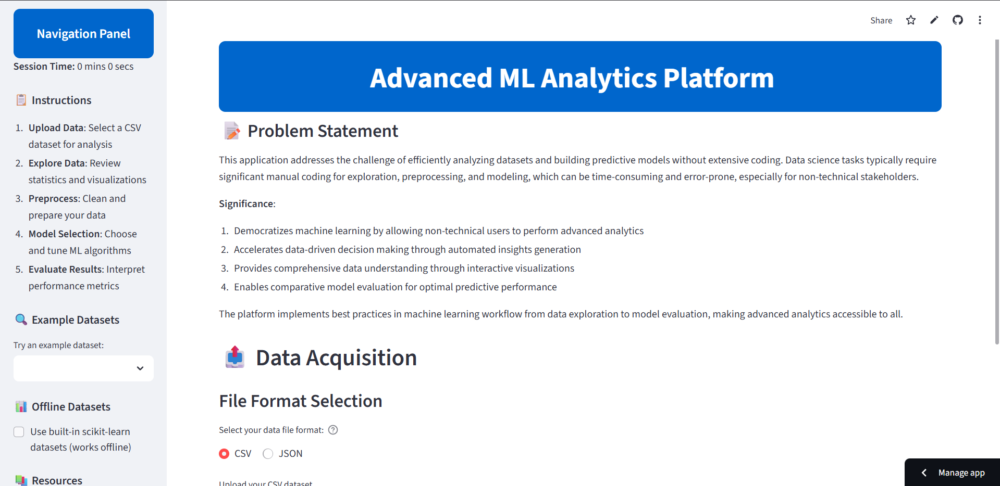
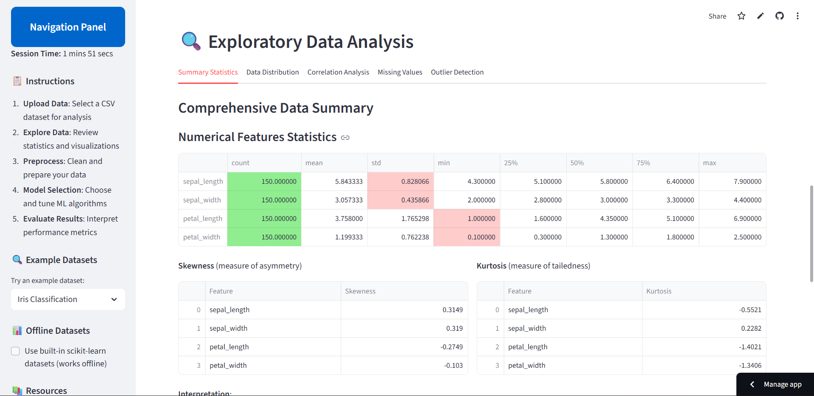
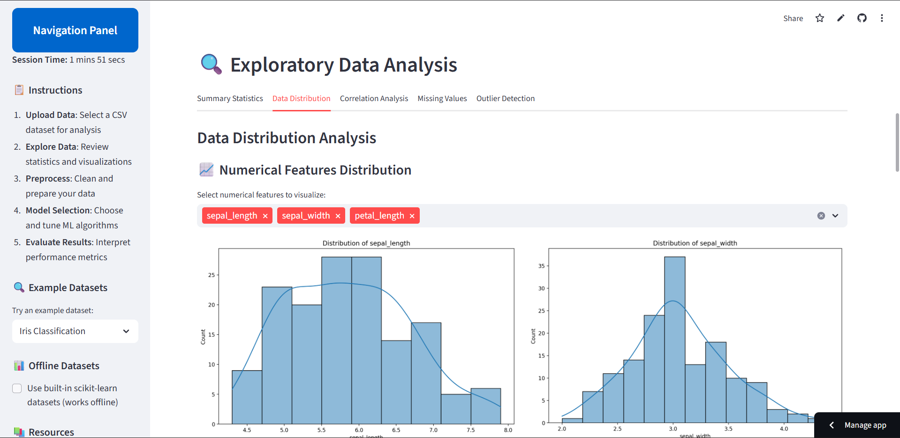
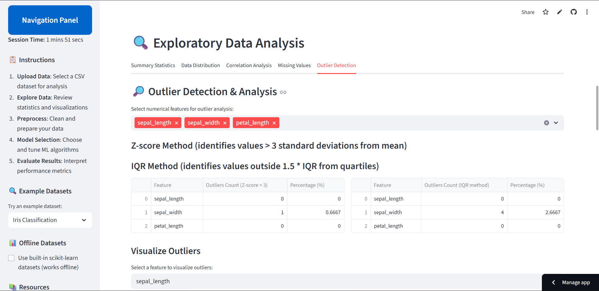
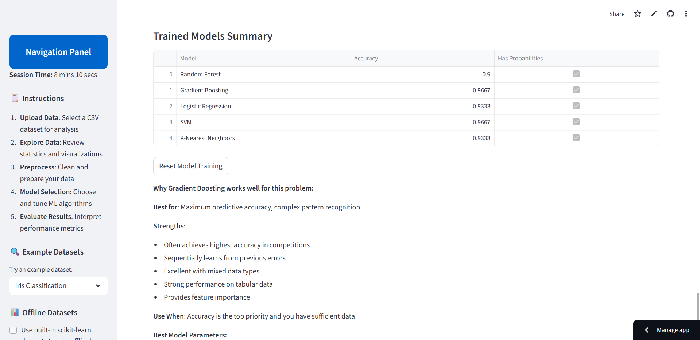
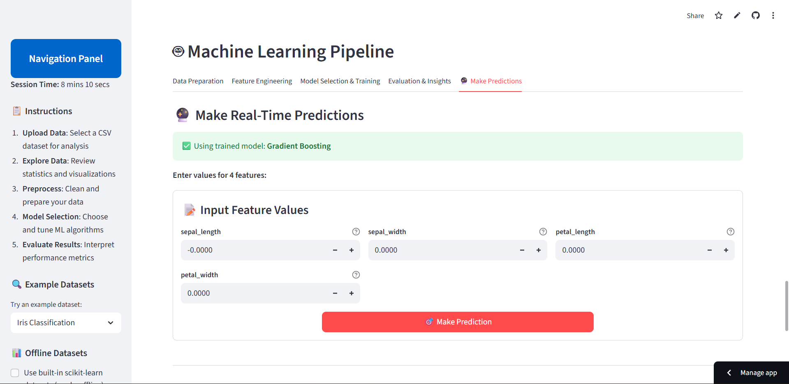

# Advanced ML Analytics Platform Screenshots

This directory contains screenshots showcasing the various features and capabilities of the Advanced ML Analytics Platform.

## Screenshots Overview

### 1. Home Page

*The landing page of our ML Analytics Platform, featuring data upload options and application overview.*

### 2. Data Summary

*Comprehensive data statistics and overview, providing key insights about the dataset at a glance.*

### 3. Data Distribution Visualization

*Interactive visualizations showing the distribution of features in the dataset, helping to understand data characteristics.*

### 4. Outlier Detection

*Advanced outlier detection tools to identify and visualize anomalies in your data.*

### 5. Model Training Results

*Detailed summary of the trained machine learning model, including performance metrics and evaluation results.*

### 6. Prediction Interface

*User-friendly interface for making predictions with trained models and visualizing the results.*

## Features Demonstrated

These screenshots showcase the platform's key capabilities:

- Interactive data upload and exploration
- Comprehensive statistical analysis
- Automated feature engineering
- Advanced data visualizations
- Machine learning model training and evaluation
- User-friendly prediction interface
- Support for both classification and regression tasks
